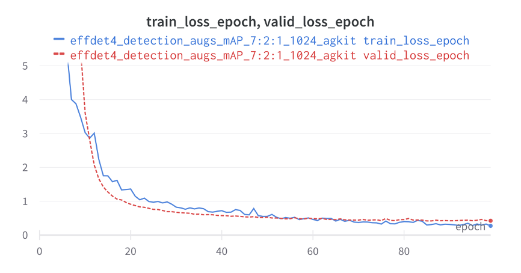
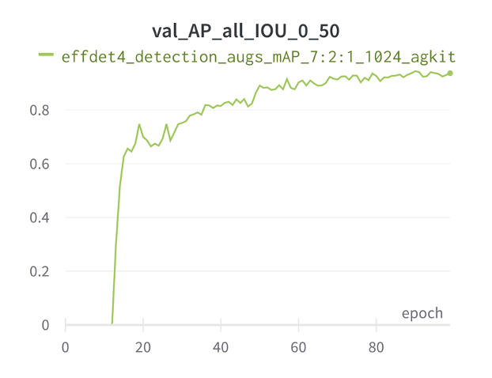

# wandb-tutorials
Thee are a set of tutorials made for increasing productivity in WandB.

Website: https://wandb.ai/site

Example Training Curve  |   Example mAP Curve
:----------------------:|:----------------------:|
|

>## Table of Contents
>- Install and Setup
>- Hyperparameter Tuning