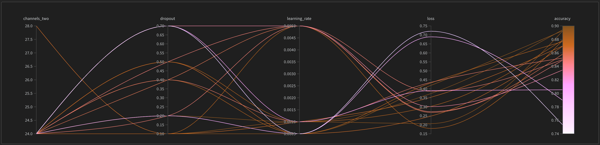

# Hyperparameter Tuning

Source: https://docs.wandb.ai/guides/sweeps

### Summary
Weights and Biases automate hyperparameter search and explore the space of possible models. This process is called "sweep". Sweeps offer different tools and visualizations for an interactive tracking experience. There are different methods to search the given hyperparameter space: Bayesian, grid search, and random search.

### Two Approaches

There are two approaches when applying sweep into your pipeline.
1. **Python Script**: Initializing your sweep within your script. This is useful when working at a small scale or in a notebook.
2. **Command Line**: Initializing your sweep within your command line interface or bash script. This is useful for parallelization or rununing multiple scripts.

### Overview

Here are the steps to run a sweep at a high level:
1. **Add W&B to your code**: In your script, add a couple lines to log hyperparameters and output metrics.
2. **Define the sweep config file**: Define variables, a range and a search method to sweep.
3. **Initialize the sweep**: Start the sweep server within your project. W&B hosts this central controller and coordinates between agents for execution.
4. **Start the sweep**: Run the sweep. This allows the agents to ask the central sweep server what hyperparameters to try next.

### Python Script Approach

Open the `sweep_python.ipynb` notebook to check the step-by-step process.

### Command Line Approach

1. Add into your code a few things:
    - Import wandb and yaml
    - Read the config file
    - Initialize wandb and pass the config parameter using `wandb.init(config=)`
    - Log your metrics using `wandb.log()`
2. Create a config.yaml file and define hyperparameters, ranges, and search method. An example can be found in `config.yaml` in the repo. For more information on how to define a configuration file, visit this link: https://docs.wandb.ai/guides/sweeps/define-sweep-configuration
    - In this case, you will be refrencing the `sweep_cli.py` script.
3. Initialize the sweep by using the command below. This will return a sweep ID.
`wandb sweep --project [project name] config.yaml`
1. Start the sweep job with this agent command:
`wandb agent --count [number of sweeps] [sweep ID]`
1. To pause, resume or stop your sweep, look at the commands below:
`wandb sweep --pause [sweep ID]`
`wandb sweep --resume [sweep ID]`
`wandb sweep --stop [sweep ID]`
`wandb sweep --cancel [sweep ID]`